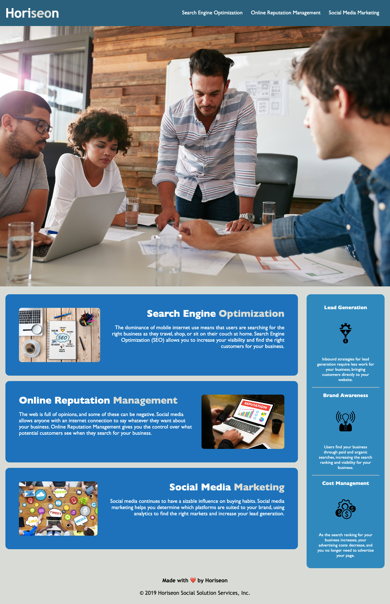

# 01-CHALLENGE

# `Horiseon Website` | Refactoring

---

## | USER STORY |
```
AS A marketing agency
I WANT a codebase that follows accessibility standards
SO THAT our own site is optimized for search engines
```

## | ACCEPTANCE CRITERIA |
```
GIVEN a webpage meets accessibility standards
WHEN I view the source code
THEN I find semantic HTML elements
WHEN I view the structure of the HTML elements
THEN I find that the elements follow a logical structure independent of styling and positioning
WHEN I view the icon and image elements
THEN I find accessible alt attributes
WHEN I view the heading attributes
THEN they fall in sequential order
WHEN I view the title element
THEN I find a concise, descriptive title
```

> ### TITLE ELEMENT

* The tittle was modified to be more `CONCISE` and `DESCRIPTIVE`, taking in consideration a good option for the research engines and making it more accesible.

<br>

> ### HEADING ATTRIBUTES

* The headings were modified in their specific order, adapting themselves to its own importance on their own sequence, plus, were merged and reformated for a cleaner code in `HTML` & `CSS`.

<br>

> ### ICON AND IMAGE ELEMENTS

* All the images were fixed with `ALT ATTRIBUTES` to give a description to them for a better understanding.

<br>

> ### STRUCTURE OF HTML ELEMENTS

* The structure was `REFORMATED`, to give it more sense to the code, using an specific order of value and separating the independent styling from the groups, therefore, the CSS was also restructured to keep it cleaner.

<br>

> ### SOURCE CODE

* The majority set of elements used on the code were replaced by `SEMANTIC ELEMENTS` to purge the non-semantic elements, for consequence, the result is an organiazed code that its easy to read.

<br>

> ### SOME OF THE CHANGES & EXTRAS

* CHANGE DIV TAGS (NON-SEMANTIC ELEMENTS) FOR SEMANTIC ELEMENTS: `HEADER` | `NAV` | `MAIN` | `SECTION` | `ARTICLE` | `ASIDE` | `FOOTER` |

* Added META description to help the research engines and improve the results

* Fixed broken link that connected with a missing id that was added

* Border Radius was implemented, margins adjusted, and text were justifyed and resized

* Unnecesary tags and elements were deleted

* HOVER EFFECT: for dynamic appareance

* MAIN: as a general container for articles

* ASIDE: Flex-direction was used to play with the position
<br>

---

<br>

## | MOCK-UP |

The following image demostrates the aftermath of the website in `APPEARANCE`, and `FUNCTIONALITY`:



> ### LINK : [CLICK Here to see the Website Result !](https://bladeo8x.github.io/01-CHALLENGE/)

<br>


> ### LANGUAGES USED ON THIS CHALLENGE:
---
&nbsp;&nbsp;&nbsp;&nbsp;&nbsp;&nbsp;&nbsp;&nbsp;&nbsp;&nbsp;&nbsp;&nbsp;&nbsp;&nbsp;&nbsp;&nbsp;
<hr>
<br>
<p align="center">
  

<br>

<p align= 'center' style="font-size:25px">
    THANK YOU FOR YOUR TIME!
</p>

